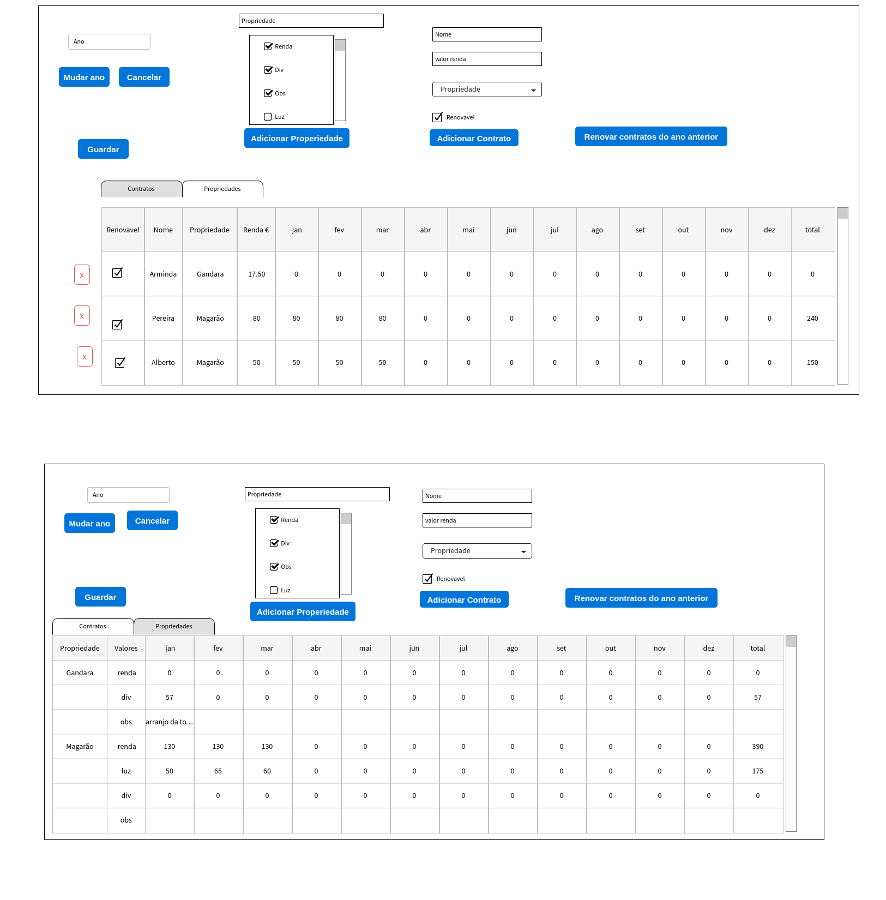

# DOCUMENTATION

## [Requisitos](requisitos/Requisitos.md)

## Design

Na primeira janela, temos um `counter com o ano`, sempre que muda o ano ele vai buscar a info desse ano e atualiza o estado das tabelas. A informação não guardada é guardada automaticamente.

Em `Adicionar Propriedade`, dá-se um nome à propriedade nova, escolhe-se os parâmetros e ao clickar no botão, o estado da tabela é atualizado com a nova propriedade.

Em `Adicionar Contrato`, dá-se o nome do inquilino, o valor de renda acordado e escolhe-se a propriedade entre as propriedades existentes na base de dados. Tem uma caixa que indica se o contrato é renovável ou não. Ao clickar no botão o estado da tabela é atualizado.

O botão `Renovar contratos do ano anterior` pega no ano a ser visualizado no momento, vai ao ano anterior na base de dados e vê quais são os contratos marcados como renovaveis e cria novos contratos para o ano escolhido. Em seguida atualiza o estado da tabela com estes novos dados.

Temos um `Tab` para alternar entre tabelas.

Na `tabela de contratos` temos em cada linha um contrato. Os valores base nome, propriedade e renda não são alteráveis. Os valores para cada mês são alteráveis, e sempre que mudam o estado da tabela é atualizado e os valores são guardados na base de dados. Há um botão de eliminar que apaga o contrato da base de dados e atualiza o estado da tabela.
Também há um checkbox para dar toggle on/off ao renovável.

Na `tabela de propriedades` cada entrada tem a propriedade com os vários parâmetros. A `renda` é calculado com base nos valores da tabela de contratos e não leva input. O resto dos parâmetros têm de ser introduzidos e sempre que um deles muda o estado da tabela é atualizado e os valores são guardados na base de dados. O `obs` serve para dar uma descrição aos valores de `div`.

O botão de `Guardar` serve para guardar na base de dados quaisquer alterações.