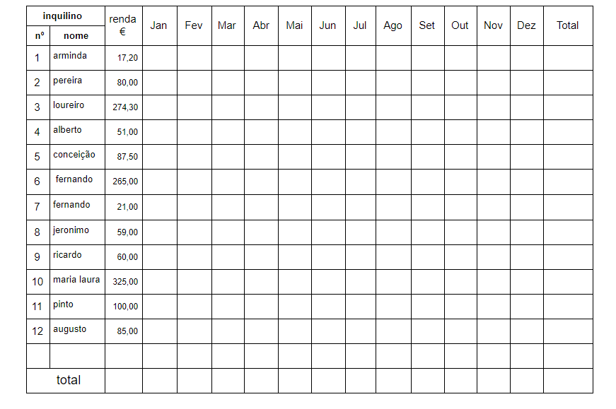
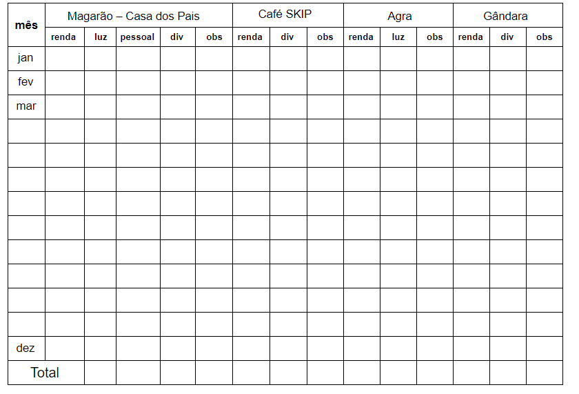
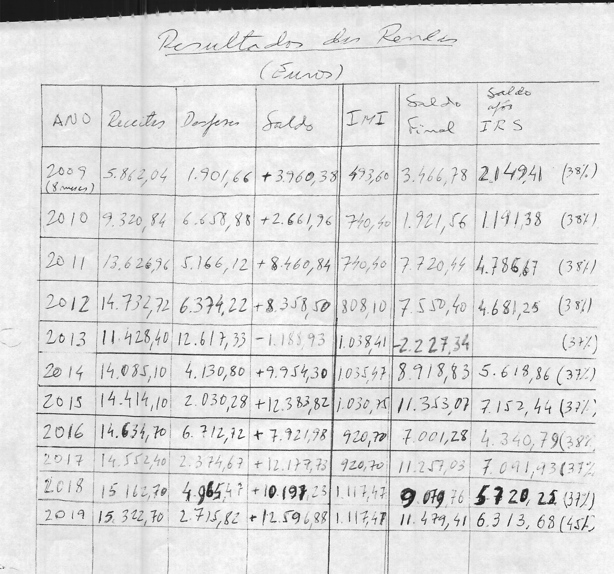

## [`<-- Home`](../HOME.md)
# Requisitos

Em cada mês a soma destes valores vai cair no quadro seguinte (receitas/despesas inquilinos)

Contrato - durante 1 ano. Associado a inquilino e uma propriedade. Tem um valor de renda estabelecido imutável. No inicio de cada ano o contrato pode ser renovado com um valor de renda igual ou diferente.

---

Renda - obrigatorio gerado

Luz- campo opcional (luz/eletricidade)

Pessoal - trabalho manual (funcionarios) opcional

Diversos - despesas imprevistas

Observacoes - texto de nota acerca dos gastos diversos

---
